# Marg AI


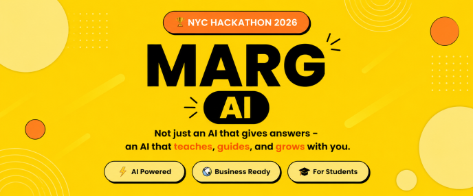

**Stop Searching. Start Learning.**

> AI-powered learning mentor that replaces endless resource-hunting with a single, personalized, trusted roadmap.

---

## Badges


> **Note:** Badge targets (`your-org/marg-ai`) are placeholders. Replace with the actual repository path before publishing.

---

## Table of Contents

- [Overview](#overview)
- [Problem Statement](#problem-statement)
- [Solution](#solution)
- [Key Features](#key-features)
- [Folder Structure](#folder-structure)
- [Screenshots](#screenshots)
- [Live Demo](#live-demo)
- [Video Demo](#video-demo)
- [User Journey](#user-journey)
- [Use Cases](#use-cases)
- [Target Audience](#target-audience)
- [Project Architecture](#project-architecture)
- [Folder Structure](#folder-structure)
- [Technology Stack](#technology-stack)
- [System Requirements](#system-requirements)
- [Installation](#installation)
- [Environment Variables](#environment-variables)
- [Running the Project](#running-the-project)
- [Configuration](#configuration)
- [API Overview](#api-overview)
- [Authentication](#authentication)
- [Database](#database)
- [AI Components](#ai-components)
- [Security](#security)
- [Performance](#performance)
- [Accessibility](#accessibility)
- [Responsive Design](#responsive-design)
- [Error Handling](#error-handling)
- [Logging](#logging)
- [Monitoring](#monitoring)
- [Deployment](#deployment)
- [CI/CD](#cicd)
- [Testing](#testing)
- [Feature Roadmap](#feature-roadmap)
- [Changelog](#changelog)
- [Known Limitations](#known-limitations)
- [Future Improvements](#future-improvements)
- [Project Timeline](#project-timeline)
- [Design System](#design-system)
- [UI Principles](#ui-principles)
- [Coding Standards](#coding-standards)
- [Git Workflow](#git-workflow)
- [Contributing](#contributing)
- [Code of Conduct](#code-of-conduct)
- [License](#license)
- [Maintainers](#maintainers)
- [Contributors](#contributors)
- [Acknowledgements](#acknowledgements)
- [Support](#support)
- [Contact](#contact)
- [FAQ](#faq)
- [Repository Statistics](#repository-statistics)
- [Appendix](#appendix)

---

## Overview

Marg AI is an AI-powered learning mentor for students and self-learners. Rather than leaving learners to sift through scattered resources across YouTube, courses, documentation, blogs, and GitHub repos, Marg AI assesses a learner's current level and goals and generates a single personalized roadmap — complete with curated resources, a timeline, and an on-demand AI tutor that has full context on where the student is in their journey.

**Core bet:** curation and personalization beat unlimited access. Marg AI is not a search engine or a content aggregator — it is a mentor.

**Primary persona (MVP focus):** a first- or second-year engineering/college student in India, self-teaching a technical skill (e.g. Python, web development) outside their curriculum, with 1–4 hours/day available, motivated by placements or projects, currently overwhelmed by free content online.

Marg AI is explicitly **not** targeting enterprise L&D, K-12, or non-technical/creative skill domains in v1.

---

## Problem Statement

Learners today don't lack resources — they're drowning in them. For any given topic, a student can find hundreds of videos, courses, and docs, but no clear answer to "what should I actually do next, given where I am?"

| Symptom | Root Cause |
|---|---|
| Hours lost browsing/comparing resources | No single source of curated truth |
| Starting and abandoning multiple courses | No structured, sequenced path |
| Low confidence, no sense of progress | No visibility into "how far am I" |
| Generic doubt-solving (ChatGPT/Google) | No context on what the learner has already studied |
| Random, unstructured learning | No adaptive timeline tied to actual pace |

The bottleneck isn't access to content — it's the **decision layer** on top of that content.

---

## Solution

Marg AI removes the decision layer's burden from the learner by:

1. Running a short AI assessment to capture goal, level, available time, learning style, and objective.
2. Generating a **Student Profile** that persists as context for every downstream feature.
3. Generating a single, sequenced **Roadmap** with prerequisites, difficulty, estimated time, and learning outcomes per topic.
4. Attaching exactly one curated resource per category (video, official doc, practice platform, mini-project) per topic — deliberately avoiding resource lists.
5. Converting the roadmap into a **week-by-week timeline** tied to the learner's stated hours.
6. Providing a **context-aware AI Doubt Solver** that knows the learner's roadmap, level, and history.
7. Tracking **progress** and surfacing it on a daily-use **Dashboard**.

---

## Key Features

| Feature | Description | Benefit | Status |
|---|---|---|---|
| AI Assessment (Onboarding) | 5-question flow: goal, current level, daily study hours, learning preference, primary objective | Feeds every downstream personalization feature | Must-Have (MVP) |
| Student Profile | AI-generated summary of level, learning speed, goal, available time, preferred style | Persistent context for roadmap and doubt solver | Must-Have (MVP) |
| Personalized Roadmap Generation | AI-generated sequenced topic list with prerequisites, difficulty, time estimate, outcome | Core "single source of truth" learning path | Must-Have (MVP) |
| Curated Resource per Topic | One best video/playlist, one official doc, one practice platform, one mini-project | Directly solves information overload | Must-Have (MVP) |
| Timeline / Weekly Plan | Auto-generated week-by-week schedule based on available hours | Turns an abstract roadmap into a daily habit | Must-Have (MVP) |
| Dashboard | Current goal, today's topic, progress %, upcoming topic, quick AI chat | Primary daily retention surface | Must-Have (MVP) |
| AI Doubt Solver | Context-aware chat with access to roadmap/level/history | Differentiator vs. generic ChatGPT/Google use | Must-Have (MVP) |
| Progress Tracking | Completed/current/remaining topics, roadmap completion % | Motivation + adaptive timeline input | Must-Have (MVP) |
| Auth | Google OAuth + email login | Baseline requirement for personalization | Must-Have (MVP) |
| Free Tier with Usage Caps | Limited AI chat, limited roadmaps, basic resources | User acquisition before monetization | Must-Have (MVP) |
| AI-Generated Mind Maps | Visual topic breakdown per completed topic | Revision aid | Should-Have (Post-MVP) |
| AI Topic Summaries | Short notes, key concepts, common mistakes, interview questions | Reinforces learning per topic | Should-Have (Post-MVP) |
| Adaptive Timeline Recalculation | Roadmap/timeline adjusts to actual completion pace | Keeps plan realistic over time | Should-Have (Post-MVP) |
| Premium Tier (Gold) | Unlimited AI, priority responses, advanced mind maps/summaries, PDF export | Monetization | Should-Have (Post-MVP) |
| Recent Activity / Learning Timeline Widget | Session history for motivation | Habit reinforcement | Should-Have (Post-MVP) |
| OTP Login | Additional login method | Low marginal value at launch | Nice-to-Have (v2+) |
| PDF Export of Roadmap | Export roadmap as PDF | Convenience | Nice-to-Have (v2+) |
| Theme Customization | Beyond Free/Premium color themes | Cosmetic | Nice-to-Have (v2+) |
| Multi-language Support | Non-English support | Needed for scale, not MVP validation | Nice-to-Have (v2+) |
| Testimonials / Social Proof | Landing page marketing sections | Marketing polish | Nice-to-Have (v2+) |
| Notifications System | Habit-forming reminders | Improves retention, not core-loop-critical | Nice-to-Have (v2+) |
| AI Preference Settings | Fine-tuning of AI behavior | Valuable once tuning needs are known | Nice-to-Have (v2+) |

---

## Folder Structure
 
Per Section 3 of the Technical Architecture Document:
 
```
marg-ai/
├── src/
│   ├── app/                          # Next.js App Router
│   │   ├── (marketing)/               # Public, SSG/SSR pages
│   │   │   ├── page.tsx                  # Landing page
│   │   │   ├── pricing/page.tsx
│   │   │   └── layout.tsx
│   │   │
│   │   ├── (auth)/
│   │   │   ├── login/page.tsx
│   │   │   ├── signup/page.tsx
│   │   │   └── layout.tsx
│   │   │
│   │   ├── (app)/                     # Authenticated app, requires session
│   │   │   ├── assessment/page.tsx        # AI Assessment flow
│   │   │   ├── dashboard/page.tsx
│   │   │   ├── roadmap/
│   │   │   │   ├── page.tsx               # Full roadmap view
│   │   │   │   └── [topicId]/page.tsx     # Topic detail (resources, mindmap, summary)
│   │   │   ├── chat/page.tsx              # AI Doubt Solver (full view)
│   │   │   ├── profile/page.tsx
│   │   │   ├── settings/page.tsx
│   │   │   └── layout.tsx                 # Auth guard + shared dashboard nav
│   │   │
│   │   └── api/                       # Route Handlers
│   │       ├── assessment/route.ts        # Submit assessment answers
│   │       ├── roadmap/
│   │       │   ├── generate/route.ts      # Trigger roadmap generation job
│   │       │   └── [id]/route.ts
│   │       ├── topics/[id]/
│   │       │   ├── complete/route.ts      # Mark topic complete, trigger mindmap+summary job
│   │       │   └── route.ts
│   │       ├── chat/route.ts              # Doubt solver endpoint
│   │       ├── resources/verify/route.ts  # Resource verification webhook/job
│   │       ├── webhooks/
│   │       │   ├── payments/route.ts
│   │       │   └── supabase/route.ts
│   │       └── jobs/                      # Background job triggers/callbacks
│   │
│   ├── components/
│   │   ├── ui/                        # Shadcn primitives
│   │   ├── dashboard/                 # Dashboard widgets (TodayTopic, ProgressBar, etc.)
│   │   ├── roadmap/                   # RoadmapView, TopicCard, TimelineView
│   │   ├── chat/                      # ChatWindow, MessageBubble
│   │   ├── assessment/                # QuestionStep components
│   │   └── shared/                    # Nav, ThemeProvider (Blue/Gold), Footer
│   │
│   ├── lib/
│   │   ├── supabase/
│   │   │   ├── client.ts                  # Browser client
│   │   │   ├── server.ts                  # Server client (RLS-aware)
│   │   │   └── admin.ts                   # Service-role client (background jobs only)
│   │   ├── ai/
│   │   │   ├── provider.ts                # Abstraction over Gemini/OpenAI
│   │   │   ├── prompts/                   # Versioned prompt templates
│   │   │   │   ├── generateRoadmap.ts
│   │   │   │   ├── generateMindmap.ts
│   │   │   │   ├── generateSummary.ts
│   │   │   │   └── doubtSolver.ts
│   │   │   ├── schemas.ts                 # Zod schemas validating AI JSON output
│   │   │   └── costLogger.ts
│   │   ├── resources/
│   │   │   ├── youtubeSearch.ts
│   │   │   └── urlVerification.ts
│   │   ├── jobs/                      # Background job definitions (Inngest/Trigger.dev)
│   │   └── utils/
│   │
│   ├── types/                         # Shared TypeScript types (mirrors DB schema)
│   ├── hooks/                         # useRoadmap, useProgress, useChat (React Query wrappers)
│   └── styles/
│
├── supabase/
│   ├── migrations/                    # SQL migration files (source of truth for schema)
│   └── seed.sql                       # Seed data for local dev (sample roadmap, topics)
│
├── public/
├── .env.local.example
├── next.config.js
├── tailwind.config.ts
├── tsconfig.json
└── package.json
```
 
**Key structural decisions:**
- Route groups `(marketing)`, `(auth)`, `(app)` separate concerns cleanly — the `(app)` group enforces the auth guard once, in one layout file, rather than per-page.
- `lib/ai/` is isolated from `app/api/` — routes call into this layer rather than containing prompt logic directly, which is what makes provider-swapping and prompt versioning possible without a rewrite.
- `lib/supabase/admin.ts` (service role) is only ever imported by background jobs, never by route handlers that respond directly to user requests — this is a security boundary, not just an organizational one.
---

## Screenshots

> Screenshots are not available in the source documentation. Placeholders below should be replaced with actual captures before publishing.

| Home | Profile |
|---|---|---|
| 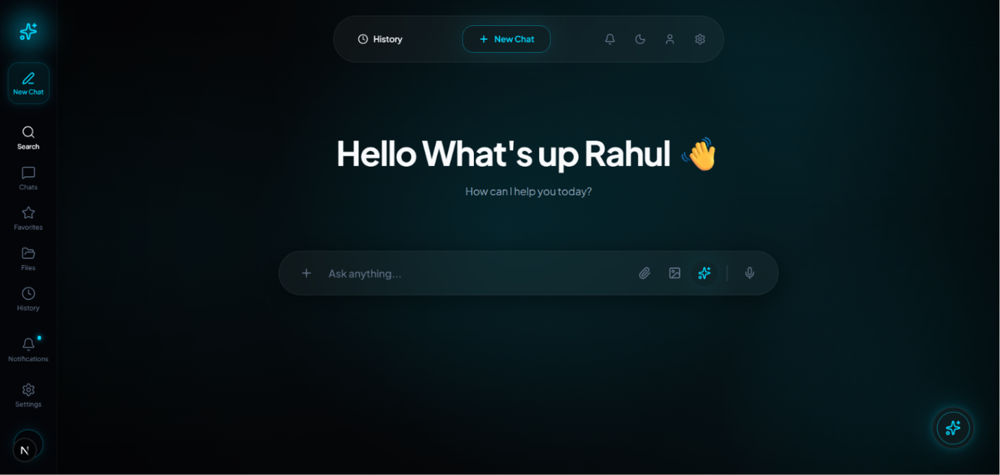 | 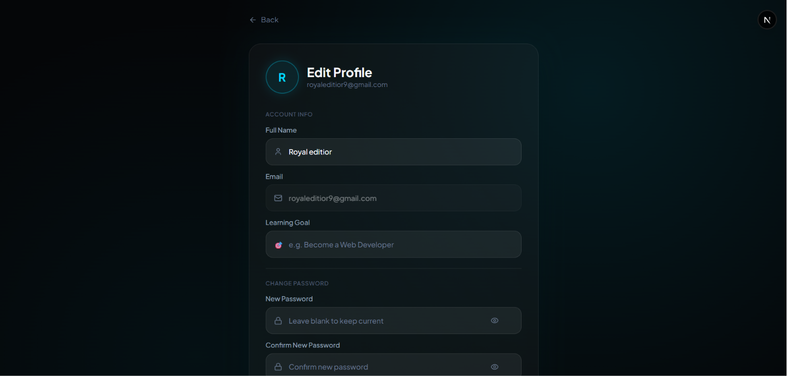 |

| Settings | AI Chat |
|---|---|---|
| 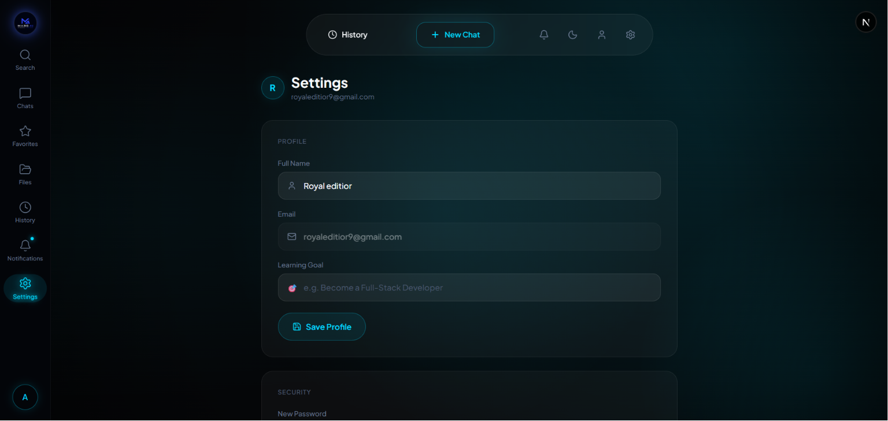 |  |

| Landing Page | Mobile View |
|---|---|---|
| 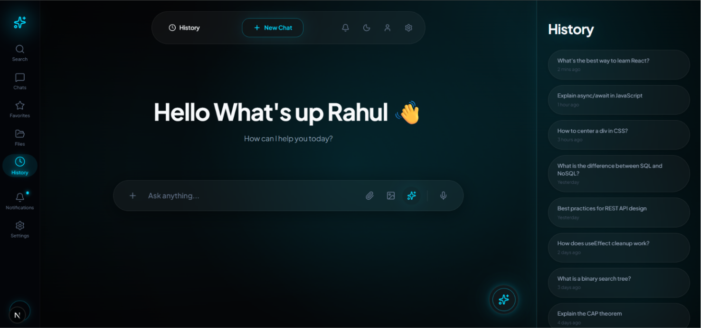 | 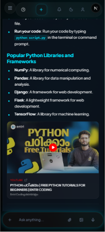 |

| Tablet View | Desktop View |
|---|---|
| 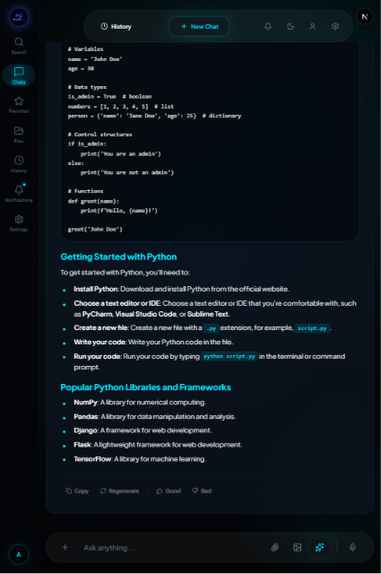 | 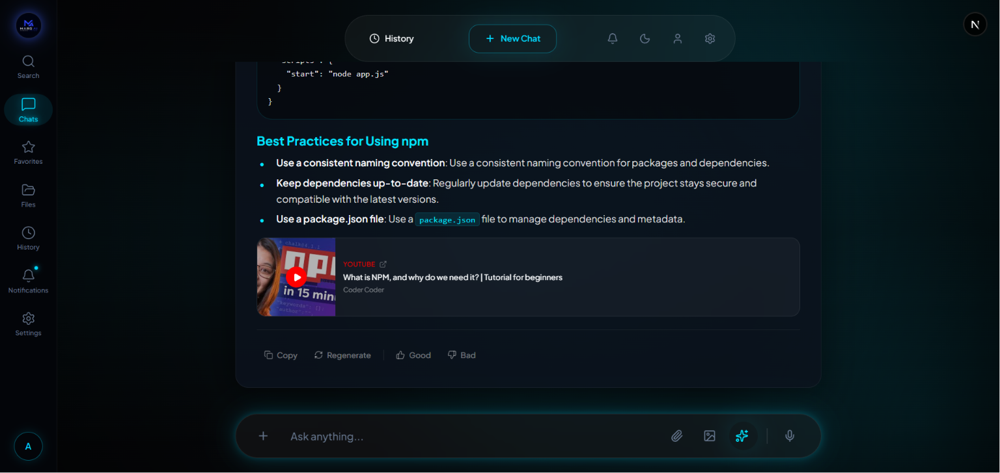 |

---

## Live Demo

Not documented.

---

## Video Demo

Not documented.

---

## User Journey

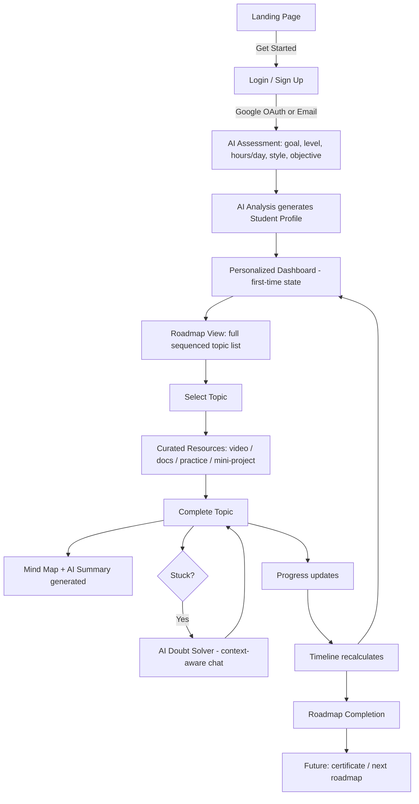

**Key UX principle:** the student should never need to leave the roadmap to figure out "what's next." Every screen should have an obvious next action.

---

## Use Cases

| User | Goal | How Marg AI Helps |
|---|---|---|
| First-year college student | Structured onboarding into a new field with zero prior context | Generates a sequenced roadmap and daily plan from a 5-question assessment |
| Complete beginner / self-learner | A trusted starting point and sequence | Replaces open-ended searching with one curated path |
| Placement aspirant | Goal-driven, timeline-bound prep with interview readiness | Timeline generation tied to available hours, plus topic-level readiness |
| Student switching domains | Fast, level-appropriate re-orientation without repeating known basics | Assessment captures current level to skip redundant fundamentals |

---

## Target Audience

- **First-year college students** needing structured onboarding into a technical field.
- **Complete beginners / self-learners** who need a trusted starting point.
- **Placement aspirants** who need goal-driven, timeline-bound preparation.
- **Students switching domains** who need fast, level-appropriate re-orientation.

Marg AI is explicitly **not** built in v1 for enterprise L&D, K-12 learners, or non-technical/creative skill domains.

---

## Project Architecture

> No Technical Architecture Document was provided. The diagram below is derived only from the **proposed, unvalidated tech stack** listed in the PRD appendix and should not be treated as a confirmed system design.

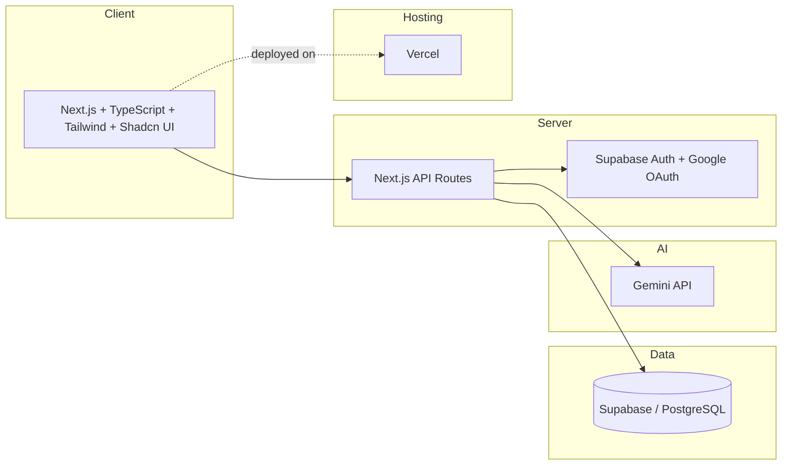

Detailed request flow, microservice boundaries, authentication flow diagrams, and database ER diagrams are **not documented** — no Technical Architecture Document was supplied.

---

## Folder Structure

Not documented. No source repository, technical architecture document, or frontend specification was provided to derive an accurate folder tree.

---

## Technology Stack

> Sourced entirely from the PRD appendix, which itself labels this stack **"proposed... unvalidated by this PRD."**

### Frontend

| Technology | Purpose |
|---|---|
| Next.js | Application framework |
| TypeScript | Type-safe language |
| Tailwind CSS | Styling |
| Shadcn UI | Component library |

### Backend

| Technology | Purpose |
|---|---|
| Next.js API Routes | Backend API layer |

### Database

| Technology | Purpose |
|---|---|
| Supabase / PostgreSQL | Primary data store |

### Authentication

| Technology | Purpose |
|---|---|
| Supabase Auth | Auth provider |
| Google OAuth | Login | 

### AI

| Technology | Purpose |
|---|---|
| Gemini API | AI assessment, roadmap generation, doubt solver |

### Infrastructure / Deployment

| Technology | Purpose |
|---|---|
| Vercel | Deployment target |

### Testing / CI-CD / Monitoring / Caching / Storage / DevOps / Security / Package Manager

Not documented.

---

## System Requirements

Not explicitly documented as a standalone section in the source materials. The following is inferred from the chosen stack (Next.js 14+, Supabase, TypeScript):
 
| Requirement | Minimum / Recommended |
|---|---|
| Node.js | 18.17+ (required by Next.js 14 App Router) |
| Package manager | npm, pnpm, or yarn |
| Git | Any recent version |
| Supabase CLI | Latest, if running/managing migrations locally |
| Supabase account | Required (managed Postgres + Auth) |
| Google Cloud project | Required (for Google OAuth credentials) |
| Gemini API access | Required (primary AI provider) |
| Operating system | OS-agnostic (Node.js + web-based tooling only) |
| Browser (for using the app) | Modern evergreen browser (Chrome, Edge, Firefox, Safari) — no documented minimum version, since the PRD specifies a web-first, Next.js approach without listing supported browser versions |

 
---

## Installation

These steps are derived from the recommended stack and project structure in the Technical Architecture Document (Section 2–3). No installation scripts have been implemented yet, so treat this as the intended setup path rather than a verified, tested procedure.
 
1. **Clone the repository**
```bash
   git clone <repository-url>
   cd marg-ai
```
 
2. **Install dependencies**
```bash
   npm install
   # or: pnpm install / yarn install
```
 
3. **Set up Supabase**
   - Create a project at [supabase.com](https://supabase.com).
   - Install the Supabase CLI if you plan to run migrations locally:
```bash
     npm install -g supabase
```
   - Apply schema migrations (per Section 5.2 of the architecture doc, migrations in `supabase/migrations/` are the single source of truth for schema):
```bash
     supabase link --project-ref <your-project-ref>
     supabase db push
```
   - Enable Row Level Security (RLS) on every user-scoped table **before** inserting real user data.
4. **Configure Google OAuth**
   - Create OAuth credentials in Google Cloud Console.
   - Register separate redirect URLs for local, preview/staging, and production environments (a common early failure point noted in the architecture doc).
   - Enable Google as an auth provider in your Supabase project settings.
5. **Set up environment variables**
```bash
   cp .env.local.example .env.local
```
   Fill in the values described in [Environment Variables](#environment-variables) below.
 
6. **Run the development server**
```bash
   npm run dev
```
 
> **Note:** No `package.json`, build scripts, Docker configuration, or CI pipeline currently exist in the source documents. The commands above follow standard Next.js/Supabase conventions implied by the chosen stack, not a documented, project-specific script.
 
---

## Environment Variables

Per Section 5.1 of the Technical Architecture Document. No default values are documented; all secrets/keys must be obtained from their respective providers.
 
| Variable | Description | Required | Default | Example |
|---|---|---|---|---|
| `NEXT_PUBLIC_SUPABASE_URL` | Supabase project URL | Yes | — | `https://xxxxx.supabase.co` |
| `NEXT_PUBLIC_SUPABASE_ANON_KEY` | Public anon key; safe for client use, respects RLS | Yes | — | `eyJhbGciOi...` |
| `SUPABASE_SERVICE_ROLE_KEY` | Server-only key; bypasses RLS. Must never reach the client bundle | Yes | — | `eyJhbGciOi...` |
| `NEXT_PUBLIC_SITE_URL` | Base site URL, used for OAuth redirect URLs | Yes | — | `https://app.margai.com` |
| `GOOGLE_OAUTH_CLIENT_ID` | Google OAuth client ID | Yes | — | `123456-abc.apps.googleusercontent.com` |
| `GOOGLE_OAUTH_CLIENT_SECRET` | Google OAuth client secret | Yes | — | `GOCSPX-...` |
| `GEMINI_API_KEY` | Gemini API key (primary AI provider) | Yes | — | `AIza...` |
| `OPENAI_API_KEY` | Optional fallback/secondary AI provider | No | — | `sk-...` |
| `YOUTUBE_DATA_API_KEY` | Used to verify/search real video resources instead of relying on LLM recall | Yes | — | `AIza...` |
| `INNGEST_EVENT_KEY` | Background job event key (if using Inngest) | Conditional (if Inngest used) | — | — |
| `INNGEST_SIGNING_KEY` | Background job signing key (if using Inngest) | Conditional (if Inngest used) | — | — |
| `RAZORPAY_KEY_ID` | Payments key ID (Should-Have, needed once Premium ships) | No (until Premium launch) | — | — |
| `RAZORPAY_KEY_SECRET` | Payments key secret | No (until Premium launch) | — | — |
| `RAZORPAY_WEBHOOK_SECRET` | Payments webhook signature secret | No (until Premium launch) | — | — |
| `SENTRY_DSN` | Error tracking DSN | Recommended | — | — |
| `NEXT_PUBLIC_POSTHOG_KEY` | Product analytics key | Recommended | — | — |
| `NEXT_PUBLIC_POSTHOG_HOST` | Product analytics host | Recommended | — | — |
 
**Configuration notes:**
- Never let `SUPABASE_SERVICE_ROLE_KEY` reach the client bundle — only import the admin client inside route handlers and background job files, never inside `"use client"` components.
- Enable RLS on every table before writing a single row of real user data.
- Separate OAuth redirect URLs per environment (local, preview, production).
---

## Running the Project

Not documented (development, production, Docker, and Docker Compose workflows are not specified in the source documents). Based on the stack, the likely development command is `npm run dev`, with `npm run build` / `npm run start` for a production build — but no scripts have been confirmed against an actual `package.json`.
 
---

## Configuration

Not documented beyond the environment variables and configuration notes listed above (Section 5.2 of the Technical Architecture Document): versioning AI prompts, validating all LLM JSON output with Zod before writing to Postgres, setting hard timeouts/retry limits on AI generation jobs, and using Supabase migrations as the single source of truth for schema.
 
---

## API Overview

Not documented as a formal API specification. The Technical Architecture Document's proposed file structure (Section 3) implies the following Route Handlers, but no request/response contracts, auth headers, or error formats are specified:
 
- `POST /api/assessment` — submit assessment answers
- `POST /api/roadmap/generate` — trigger roadmap generation job
- `GET /api/roadmap/[id]`
- `GET /api/topics/[id]`
- `POST /api/topics/[id]/complete` — mark topic complete, trigger mind map + summary generation
- `POST /api/chat` — doubt solver endpoint
- `POST /api/resources/verify` — resource verification webhook/job
- `POST /api/webhooks/payments`
- `POST /api/webhooks/supabase`
No endpoints beyond these inferred routes should be assumed or invented.
 
---

## Authentication

- **Method:** Google OAuth and email login (per PRD, Section 5.1 and MVP scope).
- Auth is listed as a **Must-Have** baseline requirement — "no personalization possible without an account."
- MVP scope restricts login to Google + Email only; **OTP login is explicitly deferred to v2+ (Nice-to-Have)**.
- JWT/session mechanics, RBAC, permissions, and token handling are **not documented**.

---

## Database

The PRD appendix provides a reference data model (explicitly labeled as being sourced "from concept doc"):

| Entity | Fields |
|---|---|
| Users | id, name, email, goal, level, study_hours, learning_style |
| Roadmaps | id, user_id, title, estimated_time, status |
| Topics | id, roadmap_id, topic, summary, mindmap, resources |
| Resources | id, topic_id, video, documentation, practice, project |
| Chat History | id, user_id, question, answer |

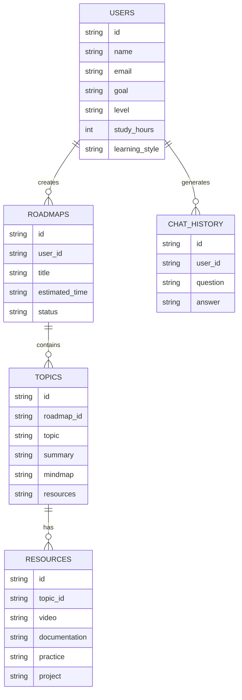

Proposed database technology: Supabase / PostgreSQL. Indexes, migration strategy, and exact column types are **not documented**.

---

## AI Components

| Aspect | Detail |
|---|---|
| LLM Provider | Gemini API (proposed, per PRD appendix) |
| AI Assessment | Interprets 5-question onboarding flow into a Student Profile |
| Roadmap Generation | Produces sequenced topics with prerequisites, difficulty, time estimates, outcomes |
| Resource Curation | Open question in the PRD (Section 10, Q1): whether curation is pure LLM generation or LLM + human editorial review before display to students. PRD recommends a **hybrid approach** for MVP given quality is "existential to the product." |
| AI Doubt Solver | Context-aware chat with access to the student's roadmap, level, and history — explicitly differentiated from generic ChatGPT/Google use |
| Fallback Behavior | Open question in the PRD (Section 10, Q4): whether the Doubt Solver should silently best-effort answer or explicitly escalate/flag when it cannot answer confidently — **not resolved in the source document** |
| Mind Maps / Summaries | Should-Have (post-MVP): AI-generated mind maps per completed topic and short AI-generated notes/summaries |
| Adaptive Timeline | Should-Have (post-MVP): timeline recalculates based on actual completion pace, not just stated hours; MVP ships with a simplified/manual recalculation only |
| Vector Database / Embeddings / Fine-tuning / RAG / Agents | Not documented |

---

## Security

Not documented in detail as a dedicated policy. The security-relevant decisions specified across the PRD and Technical Architecture Document are:
 
- Auth via Google OAuth or email/password (Supabase Auth).
- Row Level Security (RLS) enabled on every user-scoped table, enforced at the database layer rather than solely in application code.
- `SUPABASE_SERVICE_ROLE_KEY` restricted to server-only contexts (route handlers and background jobs), never exposed to the client.
- Free tier enforced via hard usage caps rather than billing logic for MVP.
- LLM output treated as untrusted input and validated (Zod or similar) before being persisted.
- Rate-limiting recommended for the AI Doubt Solver and roadmap generation, per user, even on paid plans.
Encryption at rest/in transit specifics, secrets management tooling, and a formal validation/sanitization strategy beyond the points above are not documented.
 
---

## Performance

Not documented.

---

## Accessibility

Not documented.

---

## Responsive Design

Not documented in detail. The PRD specifies a web-first (Next.js) approach for v1 and explicitly defers native mobile apps as "a scaling decision, not a v1 one," but does not document responsive breakpoints or device support. No Frontend Specification content on this topic was available in the source review.
 
---

## Error Handling

Not documented, beyond the architecture doc's recommendation that AI generation jobs have a max retry count and a clear "generation failed, retry" UI state rather than leaving a topic stuck in a `generating` state indefinitely.
 
---

## Logging

Not documented in detail beyond the recommended `ai_usage_logs` table, which logs `call_type`, `provider`, `tokens_used`, and `estimated_cost_usd` per user for every AI call, from day one.
 
---

## Monitoring

Not documented in detail. Sentry (error tracking) and PostHog or Vercel Analytics (product analytics) are recommended additions in the Technical Architecture Document, intended to be wired in from week one to support the PRD's activation/engagement/retention metrics — but no dashboards, alerting thresholds, or SLOs are specified.
 
---

## Deployment

| Aspect | Detail |
|---|---|
| Target platform | Vercel (per PRD appendix, proposed and unvalidated) |
| Other platforms (AWS, Azure, GCP, Docker) | Not documented — not mentioned in any source document |

---

## CI/CD

Not documented.

---

## Testing

Not documented (unit, integration, E2E, manual testing strategy, and coverage targets are not specified in the source documents).

---

## Feature Roadmap

Derived from the PRD's MoSCoW classification (Section 5); no separate Feature Ticket List was provided.

### Must-Have (MVP)
- [ ] AI Assessment (Onboarding)
- [ ] Student Profile
- [ ] Personalized Roadmap Generation
- [ ] Curated Resource per Topic
- [ ] Timeline / Weekly Plan
- [ ] Dashboard
- [ ] AI Doubt Solver (context-aware)
- [ ] Progress Tracking
- [ ] Auth (Google OAuth + Email)
- [ ] Free tier with usage caps

### Should-Have (Early Post-MVP)
- [ ] AI-generated Mind Maps
- [ ] AI Topic Summaries
- [ ] Adaptive Timeline Recalculation
- [ ] Premium tier (Gold)
- [ ] Recent Activity / Learning Timeline widget

### Nice-to-Have (v2+, Deferred)
- [ ] OTP login
- [ ] PDF export of roadmap
- [ ] Theme customization
- [ ] Multi-language support
- [ ] Testimonials / social proof sections
- [ ] Notifications system
- [ ] AI preference settings

> No ticket-level status (In Progress / Completed) was provided; all items above are listed per the PRD's MVP scope, not actual implementation state.

---

## Changelog

Not documented. Placeholder:

```
## [Unreleased]
- Initial README generated from PRD source.
```

---

## Known Limitations

Per the PRD's explicit "Out of Scope for v1" list (Section 8):

| Not Building (v1) | Reasoning |
|---|---|
| Full domain coverage (all 6+ career goals) | Curation quality prioritized over breadth; validate on 1–2 tracks first |
| Content hosting/creation | Marg AI is a curation/mentorship layer, not a content studio |
| Certifications / accreditation | Out of core value prop; adds legal/credibility overhead |
| Team/cohort/social learning features | Adds complexity before the single-player core loop is proven |
| Native mobile apps | Web-first (Next.js) is sufficient to validate |
| Multi-language support | English-first for initial target segment |
| Adaptive real-time re-planning (ML-driven) | Requires usage data not yet available; starts rule-based |
| Enterprise/institutional accounts | Different sales motion and feature set — post-PMF |
| Payment/subscription infrastructure beyond a hard free-tier cap | Avoids billing complexity before confirming willingness to pay |

MVP additionally excludes mind maps, AI summaries, premium billing, PDF export, notifications, and multi-domain roadmap support at launch (Section 7).

---

## Future Improvements

Based on the PRD's Should-Have and Nice-to-Have backlog (Section 5.2–5.3): mind maps, AI topic summaries, adaptive timeline recalculation, a Premium (Gold) tier, a recent-activity widget, OTP login, PDF export, theme customization, multi-language support, testimonials, notifications, and AI preference settings.

Three open product questions remain unresolved per PRD Section 10:
1. Whether resource curation is pure LLM generation or LLM + human editorial review.
2. Whether a mismatch between self-reported and actual performance should trigger re-assessment.
3. Whether users can run multiple roadmaps in parallel, or should be restricted to one active roadmap at a time (PRD recommends restricting to one for MVP).
4. What the AI Doubt Solver should do when it cannot answer confidently (silent best-effort vs. explicit escalation).

---

## Project Timeline

Not documented.

---

## Design System

Not documented. No Frontend Specification Document was provided (typography, color palette, spacing, iconography, component library conventions, and animation guidelines are unspecified beyond "Tailwind CSS + Shadcn UI" as a chosen library, per the PRD appendix).

---

## UI Principles

The PRD states one explicit UX principle (Section 6): the student should never need to leave the roadmap to figure out "what's next" — every screen should have an obvious next action. No further UI/UX principles are documented.

---

## Coding Standards

Not documented.

---

## Git Workflow

Not documented.

---

## Contributing

> The following is a standard contribution guide template. No project-specific contribution process was documented in the source files.

1. **Fork** the repository.
2. **Clone** your fork:
   ```bash
   git clone https://github.com/<your-username>/marg-ai.git
   ```
3. Create a **branch** for your change:
   ```bash
   git checkout -b feature/short-description
   ```
4. Make your changes and **commit**:
   ```bash
   git commit -m "feat: short description of change"
   ```
5. **Push** to your fork:
   ```bash
   git push origin feature/short-description
   ```
6. Open a **Pull Request** against `main`, describing the change and linking any related issue.
7. For bugs or feature requests, please open an **Issue** first using the repository's issue templates (if available).
8. Follow existing code style and update documentation alongside code changes.
9. All PRs are subject to review before merge.

---

## Code of Conduct

This project follows a standard open-source Code of Conduct: be respectful, welcoming, and constructive; harassment or discriminatory behavior of any kind will not be tolerated; disagreements should be resolved through civil, technical discussion. Report violations to the maintainers listed below.

---

## License

Not documented. Add a `LICENSE` file and update this section before publishing (e.g. MIT, Apache 2.0).

---

## Maintainers

Not documented.

---

## Contributors

| Name | Role | GitHub | LinkedIn |
|---|---|---|---|
| Rahul Sharma | Full Stack Development | [RahulSharma-07](https://github.com/RahulSharma-07) | [rahul-sharma-53ba6337a](https://linkedin.com/in/rahul-sharma-53ba6337a) |
| Apoorv Khatri | UI/UX Designer & Vibe Coder | [apoorvdes](https://github.com/apoorvdes) | [apoorv-khatri-3b109b308](https://www.linkedin.com/in/apoorv-khatri-3b109b308/) |
| Garima Mittal | AI Researcher & Documentation | [heyGarima](https://github.com/heyGarima) | [garima-mittal-64b60041a](https://www.linkedin.com/in/garima-mittal-64b60041a/) |
| Ujjwal Sharma | Designer, Editor & Vibe Coder | [ujjwalsharmaa2007](https://github.com/ujjwalsharmaa2007) | [ujjwal-sharma-60a58734a](https://www.linkedin.com/in/ujjwal-sharma-60a58734a/) |
 
---

## Acknowledgements

Built with Next.js, TypeScript, Tailwind CSS, Shadcn UI, Supabase, PostgreSQL, Google OAuth, Gemini API, and Vercel — per the proposed tech stack in the PRD appendix. No other credits, inspirations, or third-party acknowledgements were documented.

---

## Support

Not documented.

---

## Contact

Not documented.

---

## FAQ

**What is Marg AI?**
An AI-powered learning mentor that generates a single personalized roadmap with curated resources instead of leaving learners to search on their own.

**Who is Marg AI for in v1?**
First- and second-year engineering/college students in India self-teaching a technical skill outside their curriculum, along with beginners, placement aspirants, and domain-switchers more broadly. Enterprise L&D, K-12, and non-technical/creative domains are explicitly out of scope for v1.

**Does Marg AI create its own courses or videos?**
No. Per the PRD's non-goals, Marg AI curates and recommends existing resources — it does not host or produce content.

**How many learning tracks does the MVP support?**
The PRD recommends launching with 1–2 tightly scoped tracks (e.g. "Python for Beginners" and "Web Development Fundamentals") rather than full open-ended domain coverage, to validate curation quality first.

**Can a user run multiple roadmaps at once?**
This is listed as an open question in the PRD; the recommendation is to restrict MVP to one active roadmap per user.

**Is there a paid tier?**
A Premium (Gold) tier is planned as a Should-Have, post-MVP feature. MVP ships with a free tier gated by hard usage caps and no billing polish.

---